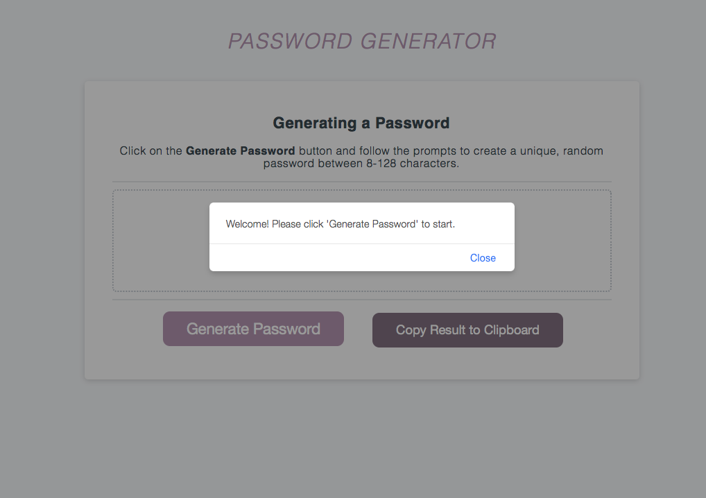
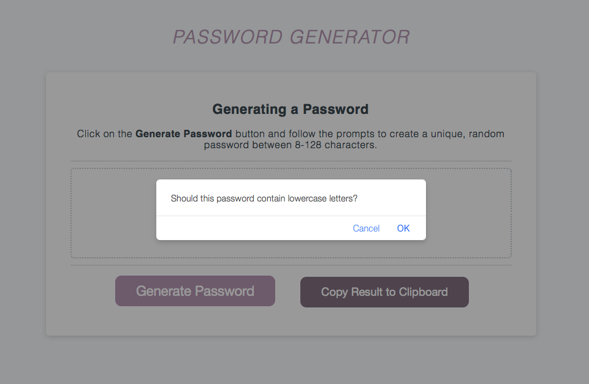

# JavaScript Password Generator

## Description and Disclaimer
Using introductory JavaScript properties and methods, I created an app that runs in the browser to generate a random, unique password based on a series of user prompts. Because password security is of the utmost importance, please bear in mind that this application was made for personal practice — the generated passwords won't be very secure.

### Link to Deployed Project:
* https://katsign.github.io/password-generator/

## Method and Approach
While HTML and CSS have set, structured ways of doing things, JavaScript logic is different — many methods can produce the same result. With this in mind, I searched the web for various methods and examples of similar builds to get me started. I arrived at the MDN documentation on [array.prototype.push methods](https://developer.mozilla.org/en-US/docs/Web/JavaScript/Reference/Global_Objects/Array/push) and applied what I learned to my code, yielding satisfyingly clear results.

What I'm really doing in this code is using static variables (arrays of characters, numbers and symbols) and a series of dynamic conditionals to append and merge the array content based on values supplied from the prompts. This information is then run through a Math Random function to ensure a unique return each time. I wanted to use a minimal amount of steps to do what I needed to do and I feel the clean code of the script file reflects this.

I made signicantly fewer commits than previous projects because of this simplification and the access to starter files. I didn't need to tweak much of my first working version's code other than linking functions to the HTML and editing the CSS to suit my aesthetic taste.

## Usage
Below are screenshots of the application during runtime. Once the prompt is responded to and 'Generate Password' is clicked, the For Loop runs through the conditional prompts and the user supplies the values needed to generate a random password.

### Prompts in Action:

Character Prompt            |  Uppercase Prompt
:-------------------------:|:-------------------------:
  |  

Lowercase Prompt            |  Number Prompt
:-------------------------:|:-------------------------:
  |  

Symbol Prompt            |  Bonus Alert
:-------------------------:|:-------------------------:
  |  

At the end of the loop, the resulting password appears in the designated text area. The bonus feature invokes an executive command to copy the specified text to the user's clipboard.

## Responsiveness and Customization
This project uses media queries to ensure the responsive scaling of CSS components. I needed to duplicate these properties and apply them to a unique button ID to ensure my second Bonus button functioned correctly. I changed the colors of the buttons, the letter spacing and color of heading text and the border style of the text area. I also decided to add a permanent user prompt to begin the password generation process since the Alert function is quite fleeting.
